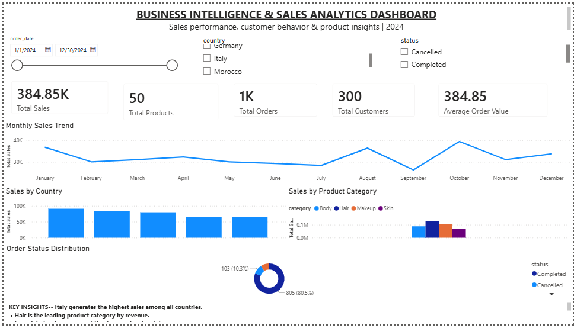
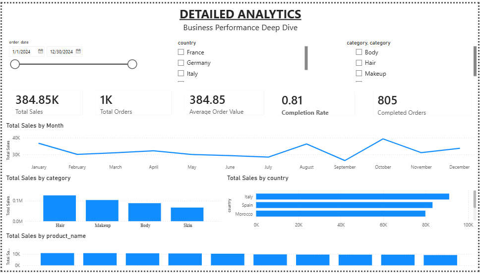

# Business Intelligence & Sales Analytics Dashboard

An interactive Business Intelligence and Sales Analytics Dashboard built using **PostgreSQL, SQL, Power BI, and DAX** to analyze sales performance, customer activity, products, countries, categories, and order status.

## 📊 Project Overview

This project demonstrates an end-to-end Business Intelligence workflow, starting with relational data stored in PostgreSQL and ending with an interactive Power BI dashboard.

The dashboard provides both an executive-level overview and detailed analytical insights to support data-driven business decisions.

## 🎯 Objectives

* Analyze overall sales performance
* Track orders, customers, and products
* Identify high-performing countries and product categories
* Monitor order status distribution
* Analyze monthly sales trends
* Identify top-performing products
* Create interactive dashboards using Power BI
* Build analytical measures using DAX
* Validate and clean relational data using SQL

## 🛠️ Technologies Used

* **PostgreSQL** — relational database and data management
* **SQL** — data validation, cleaning, and analysis
* **Power BI** — interactive dashboards and visualization
* **DAX** — calculated measures and business KPIs
* **GitHub** — project version control and documentation

## 🗄️ Data Model

The project uses five related tables:

* `customers`
* `products`
* `orders`
* `order_items`
* `sales_analytics`

Key relationships include:

```text
customers
    │
    │ customer_id
    ▼
orders
    │
    │ order_id
    ▼
order_items
    │
    │ product_id
    ▼
products
```

## 📈 Dashboard Pages

### 1. Executive Dashboard

Provides a high-level overview of business performance.

**KPIs:**

* Total Sales
* Total Orders
* Total Customers
* Total Products
* Average Order Value

**Visualizations:**

* Monthly Sales Trend
* Sales by Country
* Order Status Distribution
* Sales by Product Category

**Filters:**

* Date
* Country
* Order Status

### 2. Detailed Analytics

Provides deeper analysis of sales and product performance.

**KPIs:**

* Total Sales
* Total Orders
* Average Order Value
* Completed Orders
* Completion Rate

**Visualizations:**

* Sales Performance Over Time
* Revenue by Product Category
* Sales by Country
* Top Products by Revenue

**Filters:**

* Date
* Country
* Product Category

## 🔄 Dashboard Interactivity

The dashboard includes interactive slicers and filters that allow users to dynamically analyze the data.

Users can filter the dashboard by:

* Country
* Product Category
* Order Status
* Month/Date

The dashboard supports interactive analysis across KPIs and visualizations.

## 💡 Key Business Insights

Based on the dashboard analysis:

* Total sales reached approximately **384.85K**.
* The dataset contains approximately **1K orders**.
* The customer base consists of **300 customers**.
* The product catalog contains **50 products**.
* **Italy** generated the highest sales among the analyzed countries.
* **Hair** was the highest-performing product category.
* **Completed** was the most common order status.
* **October** recorded the highest monthly sales.

## 🧹 Data Preparation & Validation

SQL was used to validate and clean the underlying relational data before visualization.

During data validation, inconsistencies were identified in the product data. A corrected product dataset was created and used to restore the product information while maintaining the relationships with `order_items`.

The final product table contains **50 validated product records**.

## 📊 Business Value

The dashboard enables users to quickly identify:

* Overall sales performance
* High-performing countries
* Leading product categories
* Order completion patterns
* Monthly sales trends
* Top-performing products

These insights can support faster performance monitoring and data-driven business decisions.

## 📸 Dashboard Preview

### Executive Dashboard



### Detailed Analytics



## 📁 Project Structure

```text
business-intelligence-sales-analytics-dashboard/
│
├── README.md
│
├── PowerBI/
│   └── Bi_analytics.pbix
│
├── SQL/
│   └── data_validation_and_cleaning.sql
│
└── Screenshots/
    ├── executive-dashboard.png
    └── detailed-analytics.png
```

## 🚀 Future Improvements

Potential future enhancements include:

* Sales growth and period-over-period analysis
* Customer segmentation
* Product profitability analysis
* Sales forecasting
* Automated data refresh
* Additional advanced DAX measures

## 👩‍💻 Author

**Pallavi Mudgal**

B.Tech — Computer Science & Engineering (AI & ML)
